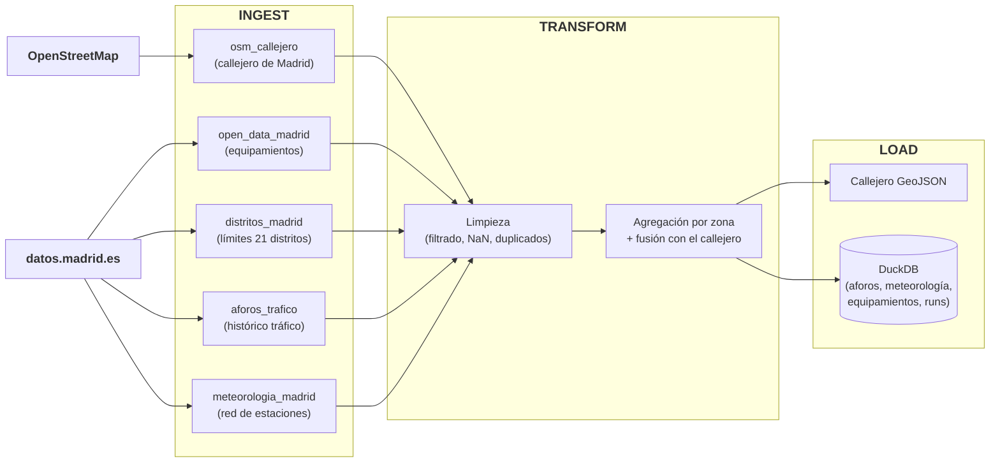

# ETL — Pipeline de Datos (P1)

Documentación de referencia del pipeline batch que alimenta el resto del proyecto (modelo de tráfico y motor de rutas). Orquestado con [Prefect](https://www.prefect.io/), pensado para que cada fuente de datos se pueda auditar, versionar y volver a ejecutar de forma independiente.

## Índice

- [Resumen](#resumen)
- [Diagrama](#diagrama)
- [Pasos del pipeline](#pasos-del-pipeline)
- [Estrategia de calidad de datos](#estrategia-de-calidad-de-datos)
- [Artefactos de salida](#artefactos-de-salida)
- [Configuración](#configuración)
- [Ejecutarlo](#ejecutarlo)
- [Módulos en vivo (para P4)](#módulos-en-vivo-para-p4)

## Resumen

El pipeline combina 4 fuentes públicas de datos de Madrid en dos artefactos finales:

- Un **GeoJSON del callejero** enriquecido con tráfico, consumido por el motor de rutas.
- Una **base de datos DuckDB** con el histórico agregado por zona/fecha/hora, consumida por el modelo de tráfico (P3).

Cada fuente vive en su propio módulo, espejado entre `pipeline/ingest/` (descarga) y `pipeline/transform/` (limpieza y transformación) — así cada una se puede probar, auditar y ejecutar por separado. `pipeline/run_pipeline.py` solo secuencia los pasos y decide qué hacer si uno falla; no contiene lógica de negocio propia.

## Diagrama



El camino de OSM es directo: solo alimenta `osm_callejero`. Las 4 fuentes de `datos.madrid.es` pasan todas por limpieza y agregación por zona antes de guardarse; aforos, además, enriquece el mismo GeoJSON (tráfico por arista) antes de guardarlo.

## Pasos del pipeline

| # | Paso | Qué hace | Módulo principal |
|---|------|----------|-------------------|
| 1 | Red viaria (OSM) | Descarga (o carga de caché con `--skip-osm`) la red conducible de Madrid vía `osmnx`; descarta vías no navegables (peatonales, ciclistas...) | `ingest/osm_callejero.py`, `transform/osm_callejero.py` |
| 2 | Equipamientos | Descarga bomberos/hospitales/centros educativos/centros de mayores desde Open Data Madrid | `ingest/open_data_madrid.py` |
| 3 | Distritos | Descarga los límites de los 21 distritos — necesario para asignar zona a cualquier otra fuente | `ingest/distritos_madrid.py` |
| 4 | Aforos (tráfico) | Descarga histórico de sensores de tráfico mes a mes, agregado en streaming a resolución horaria | `ingest/aforos_trafico.py` |
| 5 | Meteorología municipal | Descarga el catálogo de las 26 estaciones del Ayuntamiento y su histórico horario | `ingest/meteorologia_madrid.py` |
| 6 | Limpieza equipamientos | Descarta geometrías nulas o fuera del límite real de Madrid, normaliza nombres, deduplica | `transform/open_data_madrid.py::clean_equipamientos` |
| 7 | Limpieza aforos | Descarta filas sin id/fecha, deduplica por `(id_punto, fecha, hora)`, avisa de baja cobertura horaria | `transform/aforos_trafico.py::clean_aforos` |
| 8 | Limpieza meteorología | Deduplica, descarta horas marcadas inválidas por el proveedor, reshape ancho→largo | `transform/meteorologia_madrid.py::clean_meteorologia` |
| 9 | Transformación (zonas) | Asigna distrito a cada arista; agrega aforos y meteorología por `(zona, fecha, hora)` | `transform/aforos_trafico.py::procesar_aforos_para_zonas`, `transform/meteorologia_madrid.py::build_meteorologia_zonas`/`completar_meteorologia_zonas` |
| 10 | Fusión equipamientos | Cuenta equipamientos por distrito; marca sensores de aforo cercanos a cada tipo | `transform/open_data_madrid.py::merge_equipamientos`, `transform/aforos_trafico.py::marcar_equipamientos_cercanos_en_puntos` |
| 11 | Callejero final | Guarda el GeoJSON enriquecido, sobrescribiendo la ejecución anterior | `load/save_artifacts.py::save_callejero` |
| 12 | Persistencia DuckDB | Escribe todas las tablas (append-only) y el `quality_report.csv` | `load/save_artifacts.py` |

## Estrategia de calidad de datos

Algunas decisiones no son obvias mirando solo el código, así que quedan documentadas aquí:

- **`vmed` (velocidad media) no se agrega por zona.** Solo la miden los sensores M-30 (~6.5% del catálogo); el resto reporta `0.0`, no `NaN`. Promediarlo por zona diluiría la señal con ceros falsos — mejor no exponer la columna que dejarla a medias.
- **Meteorología: cero NaN garantizado, en 3 capas.**
  1. *Cobertura estructural* — cada distrito se asigna a la estación más cercana **por magnitud** (no una única estación para las 7), y se descartan las magnitudes sin cobertura suficiente (`precipitacion`, `velocidad_viento`, `direccion_viento`, `radiacion_solar`, `presion_barometrica` dejan 13-15 de 21 distritos sin dato bajo cualquier asignación — solo sobreviven `temperatura` y `humedad_relativa`).
  2. *Huecos cortos* (≤3h, sensor caído puntualmente) — interpolación lineal temporal, zona a zona.
  3. *Huecos largos* — media de las zonas geográficamente más cercanas en ese mismo instante, con fallback a la media histórica de la propia zona.
- **El callejero no lleva tráfico por arista.** `merge_aforos` sí calcula `intensidad_media`/`intensidad_mediana` por arista (y lo loguea, para saber la cobertura real), pero solo ~6% de las aristas tiene un sensor a menos de 200m — el resto quedaría en `NaN`, y rellenarlo con la media de la zona sesgaría el motor de rutas hacia congestión inventada (el tráfico varía mucho calle a calle, a diferencia del clima). Como nada consume hoy tráfico a nivel de arista (el motor de rutas usa `nivel_trafico` por zona, ver `optimizer.py`), esas columnas no se persisten en el GeoJSON — el tráfico real vive en `aforos_historicos` (DuckDB), por zona.
- **Radios de búsqueda calibrados con datos reales**, no a ojo — ver [Configuración](#configuración).

## Artefactos de salida

**`data/processed/madrid_callejero_filtered.geojson`** (se sobrescribe en cada ejecución) — la red viaria con `zona` por arista. Es lo único que lee el motor de rutas. No lleva tráfico ni cercanía a equipamientos por arista (ver estrategia de calidad de datos arriba) — eso vive en DuckDB, por zona (tráfico) y por sensor (`aforos_por_sensor.cerca_{tipo}`).

**DuckDB** (`data/processed/tfm_madrid.duckdb`, o `md:...` si usas MotherDuck vía `DUCKDB_PATH`):

| Tabla | Contenido |
|---|---|
| `aforos_historicos` | Tráfico agregado a nivel zona (zona, fecha, hora, intensidad/ocupación medias) |
| `aforos_por_sensor` | Detalle crudo por sensor y hora, con coordenadas y `cerca_{tipo}` — base para un futuro modelo de congestión por calle |
| `equipamientos` | Los 4 tipos de equipamiento en plano (lon/lat) |
| `equipamientos_por_zona` | Conteo de equipamientos por distrito y tipo |
| `meteorologia_historica` | Clima por zona/fecha/hora (`temperatura`, `humedad_relativa`, sin NaN) |
| `pipeline_runs` | Log de ejecuciones: `run_id`, fecha, fallos, `config` (JSON con los parámetros usados) |

Todas las tablas son **append-only**: cada ejecución añade filas nuevas, nunca borra las anteriores. Para quedarte solo con el estado actual, filtra por el `run_id` más reciente (cruzando con `pipeline_runs.fecha_ejecucion`).

### Consultar la base de datos

**Opción A — UI visual de DuckDB** (recomendada si quieres explorar las tablas a golpe de vista, no solo texto):

```bash
duckdb -ui data/processed/tfm_madrid.duckdb
```

Abre `http://localhost:4213` en el navegador: panel con todas las tablas, editor SQL y resultados en una tabla tipo hoja de cálculo (con scroll/orden). Ctrl+C en la terminal la cierra.

**Opción B — CLI de texto de DuckDB** (mismo binario, sin `-ui`, todo por terminal):

```bash
duckdb data/processed/tfm_madrid.duckdb

D SHOW TABLES;
D SELECT * FROM pipeline_runs ORDER BY fecha_ejecucion DESC LIMIT 5;
D SELECT * FROM aforos_historicos LIMIT 10;
```

**Opción C — Python**:

```python
import duckdb

con = duckdb.connect("data/processed/tfm_madrid.duckdb")  # o os.environ["DUCKDB_PATH"] si usas MotherDuck
print(con.execute("SHOW TABLES").df())
print(con.execute("SELECT * FROM pipeline_runs ORDER BY fecha_ejecucion DESC LIMIT 5").df())
```

Para ver solo el `run_id` más reciente de una tabla histórica (recuerda que son append-only):

```sql
SELECT * FROM aforos_historicos
WHERE run_id = (SELECT run_id FROM pipeline_runs ORDER BY fecha_ejecucion DESC LIMIT 1);
```

Si usas MotherDuck (`DUCKDB_PATH=md:tfm_madrid`), conecta igual pero con `duckdb.connect("md:tfm_madrid")` (requiere `prefect cloud login`-equivalente para MotherDuck: `duckdb.connect` te pedirá autenticarte la primera vez, o exporta `motherduck_token`).

## Configuración

`run_pipeline.run()` acepta overrides opcionales — si no se pasan, cada función usa su propio valor por defecto (calibrado con datos reales), y ese valor efectivo queda registrado en `pipeline_runs.config`:

| Parámetro | Por defecto | Calibrado con... |
|---|---|---|
| `anos_aforos` / `anos_meteorologia` | `[2024, 2025, 2026]` | — |
| `radio_aforos_m` | `200.0` m | 61852 aristas reales, 5075 sensores: a 100m solo 39.9% tiene sensor cerca, a 200m sube a 64.8%; más allá de 300-400m los rendimientos decrecen mucho |
| `radio_equipamientos_cercanos_m` | `150.0` m | mismo dataset — aquí se prioriza el efecto local (colegio en esa calle), no maximizar cobertura |
| `max_horas_interpolacion` | `3` h | huecos de sensor más largos que esto ya no se interpolan, se rellenan con la Capa 3 |
| `k_zonas_cercanas_relleno` | `3` zonas | media de cuántas zonas vecinas se usa para rellenar huecos largos de meteorología |

Ejemplo, cambiando solo el radio de aforos:

```python
from pipeline.run_pipeline import run
run(radio_aforos_m=300.0)
```

## Ejecutarlo

### Desde la terminal

```bash
python pipeline/run_pipeline.py --data-source drive       # rapido: descarga artefactos compartidos desde Google Drive
python pipeline/run_pipeline.py --data-source raw         # reproducible: descarga/procesa fuentes oficiales
python pipeline/run_pipeline.py --data-source raw --skip-osm  # si ya tienes la red OSM descargada
```

### Ver las ejecuciones en la UI de Prefect

**Opción A — Prefect Cloud** (recomendada si quieres enseñar el resultado o compartir el enlace):

1. Cuenta gratis en [app.prefect.cloud](https://app.prefect.cloud) (no pide tarjeta).
2. `prefect cloud login` — abre el navegador, autentica y conecta la CLI a tu workspace (no toca `.env`).
3. Ejecuta el pipeline normalmente. La ejecución aparece en "Flow Runs", con `run_id`, duración por paso y fallos.

**Opción B — servidor local** (sin cuenta, todo en tu máquina):

```bash
prefect server start
```

UI en `http://localhost:4200`. Añade `PREFECT_API_URL=http://127.0.0.1:4200/api` a tu `.env` (ver `.env.example`) para que `run_pipeline.py` registre ahí sus ejecuciones.

### Lanzarlo desde la propia UI (botón "Run")

Por defecto, ejecutar `run_pipeline.py` por terminal es lo único necesario — la UI sirve para *consultar*. Si además quieres *lanzarlo* con un clic (útil para una demo o defensa), deja esto corriendo en una terminal aparte:

```bash
python pipeline/serve_pipeline.py
```

Esto registra el pipeline como deployment (`tfm-madrid-bomberos`) en tu workspace activo (Cloud o local). En la UI, pestaña "Deployments" → "Run" — puedes cambiar `skip_osm`, `anos_aforos`, `radio_aforos_m`, etc. desde el propio formulario, sin tocar código. La ejecución corre en el proceso de `serve_pipeline.py`, que debe seguir abierto.

## Módulos en vivo (para P4)

Estos módulos consultan feeds en tiempo real y están pensados para que el motor de rutas los llame **en el momento de calcular una ruta**, no en este batch — no tienen histórico oficial descargable y un snapshot periódico quedaría obsoleto para cuando exista P4. Cada uno tiene dos partes: un `fetch_*` (descarga el snapshot actual) y un `merge_*` (lo asocia al grafo ya cargado). Ambos `merge_*` requieren `gdf_edges` en `EPSG:25830` — si vienes de leer el GeoJSON del callejero (que se guarda en 4326), reproyecta antes.

A diferencia del batch, aquí **no hay un `clean_*` separado en `transform/`**: al ser un único snapshot (no un histórico que acumular), la limpieza es ligera y vive dentro del propio `fetch_*`:

- `fetch_incidencias_actuales()` descarta registros con coordenadas ausentes o no numéricas, deduplica por `id_incidencia` y parsea `fh_inicio`/`fh_final` a datetime real.
- `fetch_meteorologia_actual()` se queda solo con la última hora marcada como lectura válida (`V='V'`) por estación y magnitud, descartando las horas futuras del día que el proveedor devuelve sin medir aún (`V='N'`).

### Incidencias en vía pública (obras, cortes, accidentes)

Actualizado cada ~5 min por el Ayuntamiento.

```python
from pipeline.ingest.incidencias_viapublica import fetch_incidencias_actuales
from pipeline.transform.incidencias_viapublica import merge_incidencias

gdf_incidencias = fetch_incidencias_actuales()          # GeoDataFrame ya limpio, 1 fila por incidencia activa
gdf_edges = gdf_edges.to_crs(epsg=25830)                 # si no lo está ya
gdf_edges = merge_incidencias(gdf_edges, gdf_incidencias)  # radio_m=150.0 por defecto
```

Añade a `gdf_edges`: `tiene_incidencia` (bool), `es_obras_activa` (bool), `n_incidencias_cercanas` (int). Si `fetch_incidencias_actuales()` no devuelve nada (feed caído), `merge_incidencias` no falla — deja las 3 columnas a `False`/`0` en todas las aristas.

### Meteorología en vivo

Actualizado cada ~20 min por la red municipal de 26 estaciones.

```python
from pipeline.ingest.meteorologia_madrid import fetch_meteorologia_actual
from pipeline.transform.meteorologia_madrid import merge_meteorologia_actual

df_meteo_actual = fetch_meteorologia_actual()            # DataFrame ya limpio, 1 fila por estación activa
gdf_edges = gdf_edges.to_crs(epsg=25830)                 # si no lo está ya
gdf_edges = merge_meteorologia_actual(gdf_edges, df_meteo_actual)  # k_estaciones_cercanas=3 por defecto
```

Añade `temperatura`/`humedad_relativa` a `gdf_edges` (mismo filtro de magnitudes que el batch — el modelo nunca vio las otras 5, así que tampoco se calculan aquí). Si ninguna estación activa reporta una magnitud en ese momento, esa columna simplemente no se añade — no se rellena con NaN ni con un valor inventado.
