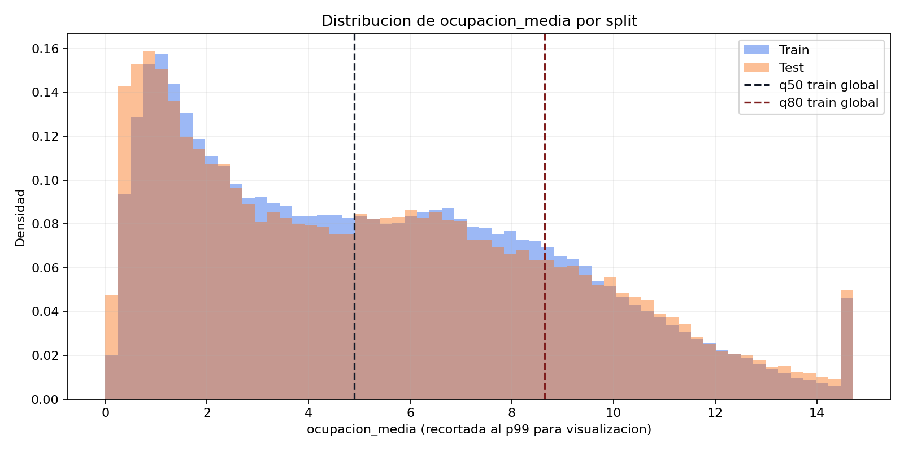
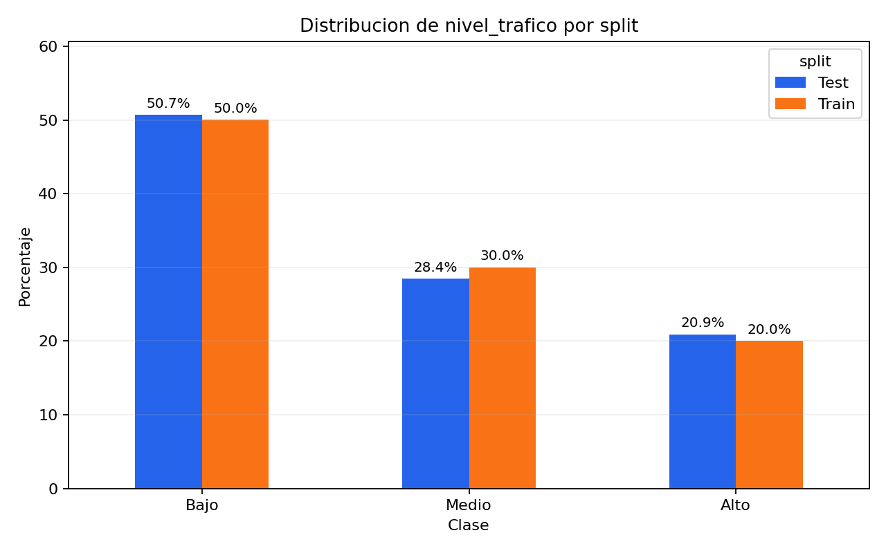
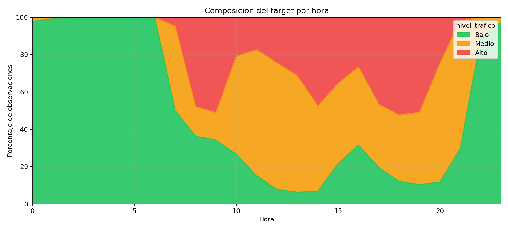
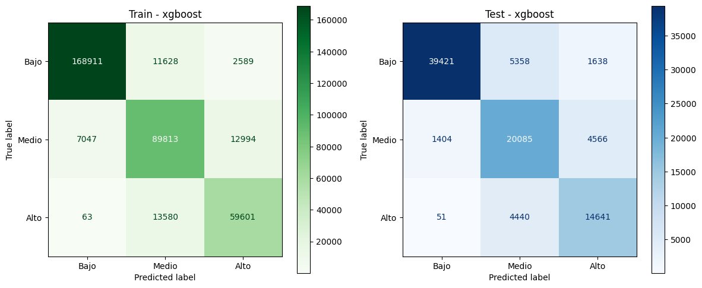
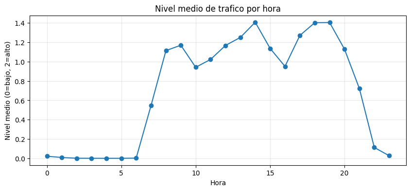
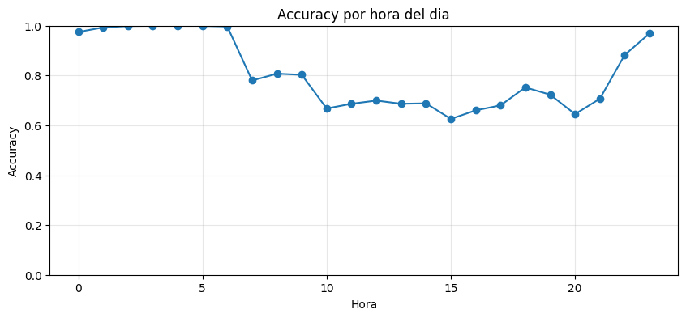
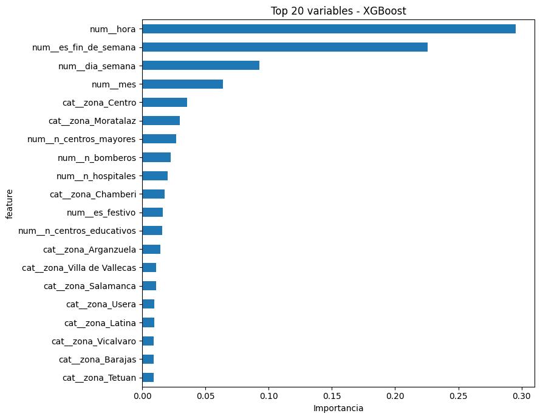
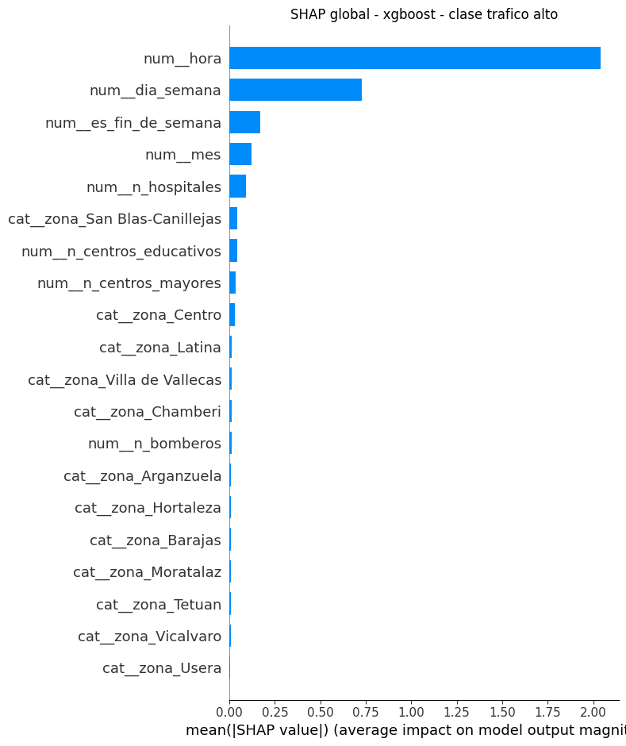
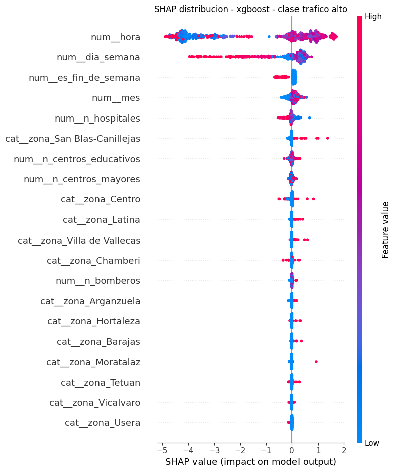

# README P3 - Modelo de Machine Learning para prediccion de trafico

Este documento recoge con detalle la parte P3 del TFM: construccion del dataset, definicion del problema, decisiones para evitar data leakage, entrenamiento de modelos, resultados, interpretabilidad y recomendaciones de integracion.

El notebook principal es:

```text
notebooks/05_modelo_xgboost_densidad_trafico.ipynb
```

## 1. Objetivo de esta parte

El objetivo de P3 es construir un modelo de Machine Learning que estime el nivel de trafico esperado en cada distrito de Madrid para una fecha y hora dadas. La salida del modelo se puede usar despues como entrada del motor de rutas, ajustando el coste de atravesar zonas con mayor congestion.

El problema final se formula como clasificacion multiclase:

| Etiqueta | Nombre | Interpretacion |
|---:|---|---|
| 0 | Bajo | Trafico bajo respecto al historico de esa zona. |
| 1 | Medio | Trafico intermedio respecto al historico de esa zona. |
| 2 | Alto | Trafico alto respecto al historico de esa zona. |

No se predice una ocupacion exacta ni una intensidad exacta. Se predice una categoria ordinal de congestion.

## 2. Fuente de datos

El modelo utiliza los datos ya generados por el pipeline del proyecto. No introduce fuentes externas nuevas.

La base principal es:

```text
data/processed/tfm_madrid.duckdb
```

Tablas relevantes:

| Tabla | Papel en el modelo |
|---|---|
| `aforos_historicos` | Tabla principal. Contiene trafico agregado por zona, fecha y hora. |
| `equipamientos_por_zona` | Variables estaticas de contexto urbano por distrito. |
| `meteorologia_historica` | Disponible, pero excluida del modelo principal para evitar dependencia de meteorologia futura. |
| `pipeline_runs` | Permite seleccionar la ejecucion mas reciente del pipeline. |

La tabla `aforos_historicos` contiene:

| Columna | Uso |
|---|---|
| `zona` | Distrito de Madrid. Tambien se usa como feature. |
| `fecha` | Fecha de la observacion historica. Se usa para crear features calendario y split temporal. |
| `hora` | Hora de la observacion. Se usa como feature. |
| `intensidad_media` | Magnitud historica observada. No se usa como feature. |
| `ocupacion_media` | Magnitud historica observada. Se usa para construir el target, no como feature. |
| `run_id` | Identificador de ejecucion del pipeline. No se usa como feature. |

## 3. Dataset final

El dataset final guardado es:

```text
data/processed/aforos_dataset_xgboost.csv
```

Tamano del dataset ejecutado:

| Conjunto | Filas | Periodo |
|---|---:|---|
| Dataset completo | 457830 | 2024-01-01 a 2026-06-30 |
| Train | 366226 | 2024-01-01 a 2025-12-29 |
| Test | 91604 | 2025-12-30 a 2026-06-30 |

El split se hace por fecha, no aleatoriamente. Esto simula mejor el caso real: entrenar con pasado y evaluar contra fechas posteriores.

## 4. Variable objetivo

La variable objetivo se llama:

```text
nivel_trafico
```

Se construye a partir de:

```text
ocupacion_media
```

Si `ocupacion_media` no existiera, el notebook esta preparado para usar `intensidad_media` como alternativa, pero en la ejecucion actual el target base ha sido `ocupacion_media`.

### 4.1. Por que ocupacion_media

`ocupacion_media` representa el porcentaje de tiempo en el que los sensores detectan vehiculos. Para un problema de congestion es mas interpretable que la intensidad bruta, porque se aproxima mejor a la idea de saturacion de la via.

### 4.2. Umbrales bajo/medio/alto

La etiqueta se define con percentiles por zona:

| Rango | Etiqueta |
|---|---|
| `ocupacion_media <= q50_zona` | Bajo |
| `q50_zona < ocupacion_media <= q80_zona` | Medio |
| `ocupacion_media > q80_zona` | Alto |

Esto significa que el nivel es relativo al comportamiento historico de cada distrito. Un `Alto` en Hortaleza no tiene por que tener la misma ocupacion absoluta que un `Alto` en Centro. Esta decision es adecuada si el objetivo es detectar momentos de congestion anomala o elevada dentro de cada zona.

### 4.3. Correccion anti-leakage en el target

Los umbrales se calculan solo con train y luego se aplican a test. Esto es importante porque calcular percentiles usando todo el dataset dejaria que la distribucion futura influyese en la etiqueta del pasado.

Umbrales globales aprendidos en train:

| Percentil | Valor |
|---|---:|
| q50 | 4.8972 |
| q80 | 8.6418 |

Ademas, el notebook guarda los umbrales por zona en:

```text
data/processed/modelo_trafico_xgboost_metadata.json
```

### 4.4. Mini EDA de la variable objetivo

Antes de entrenar, conviene comprobar que la variable objetivo tiene una distribucion razonable y que el split temporal no cambia radicalmente el problema. En esta ejecucion, la variable base del target es `ocupacion_media`.

#### Distribucion de `ocupacion_media`



| Estadistico | Train | Test |
|---|---:|---:|
| Count | 366226 | 91604 |
| Media | 5.347 | 5.293 |
| Desviacion tipica | 3.643 | 3.754 |
| Min | 0.000 | 0.000 |
| P25 | 2.124 | 1.955 |
| Mediana / P50 | 4.897 | 4.838 |
| P75 | 7.962 | 7.970 |
| P80 | 8.642 | 8.738 |
| P90 | 10.371 | 10.573 |
| P95 | 11.804 | 12.005 |
| Max | 24.995 | 22.756 |

La distribucion de `ocupacion_media` es parecida en train y test. Esto es una buena senal: el test representa fechas posteriores, pero no parece tener un cambio extremo de escala respecto al periodo de entrenamiento.

#### Distribucion de clases



| Clase | Total filas | Total % | Train filas | Train % | Test filas | Test % |
|---|---:|---:|---:|---:|---:|---:|
| Bajo | 229545 | 50.14 | 183128 | 50.00 | 46417 | 50.67 |
| Medio | 135909 | 29.69 | 109854 | 30.00 | 26055 | 28.44 |
| Alto | 92376 | 20.18 | 73244 | 20.00 | 19132 | 20.89 |

La clase `Bajo` es la mayoritaria, pero el desbalance no es extremo. Aun asi, usar solo `accuracy` seria incompleto: por eso la metrica principal es `F1 macro`, acompanada de `balanced accuracy`, precision/recall por clase y matriz de confusion.

#### Composicion del target por hora



La composicion horaria confirma que el target no es aleatorio: de madrugada domina `Bajo`, mientras que en horas de actividad aumenta la presencia de `Medio` y `Alto`. Este patron justifica que `hora` sea una de las variables centrales del modelo.

## 5. Variables utilizadas

El modelo principal utiliza solo variables disponibles antes de hacer una prediccion.

| Variable | Tipo | Disponible en produccion | Motivo |
|---|---|---:|---|
| `zona` | Categorica | Si | La API puede generar una prediccion por cada distrito. |
| `hora` | Numerica | Si | Se recibe o se deriva del instante solicitado. |
| `dia_semana` | Numerica | Si | Se deriva de `fecha`. |
| `mes` | Numerica | Si | Se deriva de `fecha`. |
| `es_fin_de_semana` | Binaria | Si | Se deriva de `fecha`. |
| `es_festivo` | Binaria | Si | Se calcula con calendario de festivos. |
| `n_bomberos` | Numerica estatica | Si | Conteo por zona procedente del pipeline. |
| `n_centros_educativos` | Numerica estatica | Si | Conteo por zona procedente del pipeline. |
| `n_centros_mayores` | Numerica estatica | Si | Conteo por zona procedente del pipeline. |
| `n_hospitales` | Numerica estatica | Si | Conteo por zona procedente del pipeline. |

Features finales de la ejecucion:

```python
[
    "zona",
    "hora",
    "dia_semana",
    "mes",
    "es_fin_de_semana",
    "es_festivo",
    "n_bomberos",
    "n_centros_educativos",
    "n_centros_mayores",
    "n_hospitales",
]
```

## 6. Variables excluidas para evitar leakage

El notebook excluye explicitamente estas variables del entrenamiento principal:

| Variable | Motivo de exclusion |
|---|---|
| `ocupacion_media` | Es la magnitud usada para construir el target. Usarla como feature seria leakage directo. |
| `intensidad_media` | Es una observacion real de trafico para esa misma hora. No estaria disponible si se predice futuro. |
| `carga_media` | Misma logica: medicion observada de trafico. |
| `ocupacion_media_lag_*` | Solo seria valida si produccion tuviera trafico observado reciente. No se asume en el modelo principal. |
| `intensidad_media_lag_*` | Igual que los lags de ocupacion. |
| `rolling_24h` | Resume trafico observado previo. Se reserva para un posible modelo de nowcasting. |
| `temperatura` | Disponible historicamente, pero para futuro haria falta forecast o meteo en vivo. |
| `humedad_relativa` | Mismo caso que temperatura. |

El notebook mantiene dos flags para experimentos futuros:

```python
USE_WEATHER_FEATURES = False
USE_LAG_FEATURES = False
```

La configuracion principal es conservadora a proposito: prioriza que el modelo pueda defenderse en produccion y en la memoria.

## 7. Modelos entrenados

Se comparan tres enfoques:

| Modelo | Papel |
|---|---|
| DummyClassifier | Baseline minimo. Sirve para comprobar que los modelos reales aprenden senal. |
| Random Forest | Modelo de arboles robusto, interpretable por importancia de variables. |
| XGBoost | Modelo principal candidato, con buen rendimiento en datos tabulares. |

## 8. Validacion

El protocolo tiene tres niveles:

1. **Split temporal final**: el 80% inicial por fecha se usa para train y el 20% final para test.
2. **TimeSeriesSplit**: se usa en baseline y Random Forest para validar respetando el orden temporal.
3. **Validacion interna temporal para XGBoost**: dentro de train se separa una ventana final para early stopping.

Fechas usadas:

| Conjunto | Inicio | Fin |
|---|---|---|
| Train completo | 2024-01-01 | 2025-12-29 |
| Validacion interna XGBoost | desde 2025-08-06 aprox. | 2025-12-29 |
| Test final | 2025-12-30 | 2026-06-30 |

El test final queda reservado hasta el final. No se usa para elegir hiperparametros.

## 9. Busqueda de hiperparametros

### 9.1. Random Forest

Grid usado:

```python
{
    "model__n_estimators": [100, 200],
    "model__max_depth": [10, 16],
    "model__min_samples_leaf": [5, 10],
    "model__max_features": ["sqrt"],
}
```

Mejores parametros:

```python
{
    "model__max_depth": 16,
    "model__max_features": "sqrt",
    "model__min_samples_leaf": 5,
    "model__n_estimators": 100,
}
```

### 9.2. XGBoost

Grid usado:

```python
{
    "max_depth": [3, 5],
    "learning_rate": [0.05, 0.10],
    "subsample": [0.8],
    "colsample_bytree": [0.8],
    "min_child_weight": [1, 5],
    "reg_lambda": [1.0],
}
```

Mejores parametros:

```python
{
    "colsample_bytree": 0.8,
    "learning_rate": 0.05,
    "max_depth": 5,
    "min_child_weight": 1,
    "reg_lambda": 1.0,
    "subsample": 0.8,
}
```

Numero de arboles seleccionado por early stopping:

```text
392
```

## 10. Resultados

> **Metrica principal de seleccion:** `F1 macro`.
>
> Se reporta tambien `accuracy` porque es facil de interpretar, pero no se usa como unica metrica: las clases no tienen exactamente la misma frecuencia y, operativamente, no interesa que el modelo acierte muchos `Bajo` si falla los `Alto`.

### 10.1. Comparativa entre modelos

| Modelo | CV F1 macro | Train accuracy | Test accuracy | Train F1 macro | Test F1 macro | Gap F1 train-test |
|---|---:|---:|---:|---:|---:|---:|
| XGBoost | 0.819 | 0.869 | 0.809 | 0.847 | 0.785 | 0.063 |
| Random Forest | 0.803 | 0.849 | 0.780 | 0.828 | 0.754 | 0.074 |
| Dummy | 0.334 | 0.381 | 0.382 | 0.334 | 0.334 | -0.001 |

XGBoost es el mejor modelo tanto en validacion como en test. La mejora frente al baseline es clara y la mejora frente a Random Forest tambien es consistente. El gap train-test de XGBoost indica cierto sobreajuste moderado, pero no un comportamiento alarmante.

### 10.2. Metricas completas del modelo ganador

Estas metricas se calculan para el pipeline final guardado (`preprocessor + XGBoost`). Incluyen metricas de clase dura (`predict`) y metricas probabilisticas (`predict_proba`).

| Metrica | Train | Test | Lectura |
|---|---:|---:|---|
| Numero de filas | 366226 | 91604 | Tamano de cada particion. |
| Accuracy | 0.869 | 0.809 | Proporcion total de aciertos. |
| Balanced accuracy | 0.851 | 0.795 | Media del recall por clase; mas robusta ante desbalance. |
| Precision micro | 0.869 | 0.809 | En multiclase coincide con accuracy. |
| Precision macro | 0.844 | 0.780 | Precision media dando igual peso a cada clase. |
| Precision weighted | 0.873 | 0.827 | Precision ponderada por soporte de clase. |
| Recall micro | 0.869 | 0.809 | En multiclase coincide con accuracy. |
| Recall macro | 0.851 | 0.795 | Recall medio dando igual peso a cada clase. |
| Recall weighted | 0.869 | 0.809 | Recall ponderado por soporte; coincide con accuracy. |
| F1 micro | 0.869 | 0.809 | F1 global por instancia. |
| F1 macro | 0.847 | 0.785 | Metrica principal para comparar modelos. |
| F1 weighted | 0.871 | 0.815 | F1 ponderado por frecuencia de clase. |
| Cohen kappa | 0.791 | 0.699 | Acuerdo corregido por azar. |
| Matthews corrcoef | 0.791 | 0.703 | Correlacion global entre etiqueta real y predicha. |
| Log loss | 0.319 | 0.471 | Calidad de probabilidades; menor es mejor. |
| ROC-AUC OvR macro | 0.966 | 0.931 | Separacion probabilistica media por clase. |
| ROC-AUC OvR weighted | 0.970 | 0.936 | Separacion probabilistica ponderada por soporte. |
| Average precision macro | 0.908 | 0.822 | Area precision-recall media por clase. |
| Average precision weighted | 0.927 | 0.858 | Area precision-recall ponderada. |
| Brier multiclase medio | 0.189 | 0.271 | Error cuadratico medio de probabilidades; menor es mejor. |

**Lectura:** las metricas bajan de train a test, como es esperable en un split temporal. Aun asi, el test mantiene `F1 macro = 0.785`, `balanced accuracy = 0.795` y `ROC-AUC OvR macro = 0.931`, lo que indica que el modelo no solo acierta etiquetas, sino que tambien separa razonablemente bien las clases en terminos probabilisticos.

### 10.3. Informe de clasificacion por clase

#### Train

| Clase | Precision | Recall | F1 | Support |
|---|---:|---:|---:|---:|
| Bajo | 0.960 | 0.922 | 0.941 | 183128 |
| Medio | 0.781 | 0.818 | 0.799 | 109854 |
| Alto | 0.793 | 0.814 | 0.803 | 73244 |
| Accuracy | | | 0.869 | 366226 |
| Macro avg | 0.844 | 0.851 | 0.847 | 366226 |
| Weighted avg | 0.873 | 0.869 | 0.871 | 366226 |

#### Test

| Clase | Precision | Recall | F1 | Support |
|---|---:|---:|---:|---:|
| Bajo | 0.964 | 0.849 | 0.903 | 46417 |
| Medio | 0.672 | 0.771 | 0.718 | 26055 |
| Alto | 0.702 | 0.765 | 0.733 | 19132 |
| Accuracy | | | 0.809 | 91604 |
| Macro avg | 0.780 | 0.795 | 0.785 | 91604 |
| Weighted avg | 0.827 | 0.809 | 0.815 | 91604 |

**Lectura por clase:** `Bajo` es la clase mas facil y estable. `Medio` y `Alto` son mas dificiles porque representan zonas de frontera entre niveles de ocupacion; aun asi, el recall de `Alto` en test es `0.765`, una cifra razonable para un sistema que debe evitar infravalorar trafico elevado.

### 10.4. Matrices de confusion



**Matriz de confusion en test**  
Filas = clase real. Columnas = clase predicha.

| Real / Predicho | Bajo | Medio | Alto |
|---|---:|---:|---:|
| Bajo | 39421 | 5358 | 1638 |
| Medio | 1404 | 20085 | 4566 |
| Alto | 51 | 4440 | 14641 |

La lectura operativa es positiva: el modelo casi nunca confunde trafico `Alto` con `Bajo` (`51` casos en todo el test). Cuando falla en la clase alta, normalmente la degrada a `Medio`, que es menos grave para un motor de rutas que tratar una zona congestionada como despejada.

## 11. Diagnostico temporal

### 11.1. Nivel medio por hora



El patron horario es muy marcado. Esto explica por que `hora` aparece como la variable mas importante: la congestion urbana tiene ciclos diarios muy estables.

### 11.2. Accuracy por hora



| Hora | Accuracy test |
|---:|---:|
| 0 | 0.975 |
| 1 | 0.993 |
| 2 | 0.999 |
| 3 | 0.999 |
| 4 | 0.999 |
| 5 | 0.999 |
| 6 | 0.997 |
| 7 | 0.780 |
| 8 | 0.807 |
| 9 | 0.803 |
| 10 | 0.668 |
| 11 | 0.687 |
| 12 | 0.699 |
| 13 | 0.687 |
| 14 | 0.688 |
| 15 | 0.626 |
| 16 | 0.660 |
| 17 | 0.680 |
| 18 | 0.752 |
| 19 | 0.723 |
| 20 | 0.645 |
| 21 | 0.707 |
| 22 | 0.883 |
| 23 | 0.969 |

El rendimiento es casi perfecto de madrugada porque domina la clase `Bajo`. En horas laborales/intermedias el problema se complica: las fronteras entre `Medio` y `Alto` son mas difusas y varian mas por distrito.

## 12. Diagnostico por zona

El rendimiento no es homogeneo entre distritos. Este analisis ayuda a explicar limitaciones del modelo y posibles lineas futuras.

### 12.1. Peores zonas por accuracy en test

| Zona | Accuracy | Filas test |
|---|---:|---:|
| Latina | 0.646 | 4372 |
| Villaverde | 0.655 | 4338 |
| Carabanchel | 0.671 | 4372 |
| Usera | 0.673 | 4372 |
| Villa de Vallecas | 0.815 | 4339 |

### 12.2. Mejores zonas por accuracy en test

| Zona | Accuracy | Filas test |
|---|---:|---:|
| Hortaleza | 0.892 | 4372 |
| Ciudad Lineal | 0.885 | 4372 |
| San Blas-Canillejas | 0.864 | 4339 |
| Moratalaz | 0.862 | 4372 |
| Puente de Vallecas | 0.858 | 4372 |

**Lectura:** algunas zonas del sur y suroeste presentan un comportamiento menos estable con las variables actuales. Una mejora natural seria incorporar variables adicionales defendibles en produccion, por ejemplo calendario laboral mas fino, eventos o meteorologia en vivo/forecast.

## 13. Interpretabilidad

El notebook calcula dos tipos de interpretabilidad:

1. Importancia interna del modelo XGBoost.
2. SHAP values para explicar la contribucion de cada variable, especialmente para la clase `Alto`.

### 13.1. Feature importance de XGBoost



| Feature | Importancia |
|---|---:|
| `hora` | 0.296 |
| `es_fin_de_semana` | 0.226 |
| `dia_semana` | 0.093 |
| `mes` | 0.064 |
| `zona_Centro` | 0.035 |
| `zona_Moratalaz` | 0.030 |
| `n_centros_mayores` | 0.027 |
| `n_bomberos` | 0.022 |
| `n_hospitales` | 0.020 |
| `zona_Chamberi` | 0.018 |
| `es_festivo` | 0.016 |
| `n_centros_educativos` | 0.016 |

La lectura es coherente: el nivel de trafico depende principalmente de la hora y del calendario. La zona y los equipamientos aportan contexto espacial.

### 13.2. SHAP global para la clase `Alto`



El grafico SHAP global mide el impacto medio absoluto de cada variable en la salida del modelo para la clase `Alto`. La variable dominante vuelve a ser `hora`, seguida de `dia_semana`, `es_fin_de_semana` y `mes`.

### 13.3. Distribucion SHAP para la clase `Alto`



Este grafico muestra, para cada observacion de la muestra, si el valor de una variable empuja la prediccion hacia `Alto` o la aleja de esa clase. La dispersion de `hora` confirma que no todas las horas actuan igual: algunas franjas reducen claramente la probabilidad de trafico alto y otras la aumentan.

## 14. Artefactos guardados

| Artefacto | Contenido |
|---|---|
| `data/processed/aforos_dataset_xgboost.csv` | Dataset final usado por el modelo. |
| `data/processed/modelo_trafico_xgboost.pkl` | Pipeline sklearn con preprocesador y modelo XGBoost ganador. |
| `data/processed/modelo_trafico_xgboost_metadata.json` | Features, metricas, hiperparametros, umbrales y configuracion. |
| `docs/p3_modelo_trafico/target_ocupacion_histograma.png` | Histograma de `ocupacion_media` por split. |
| `docs/p3_modelo_trafico/target_distribucion_clases.png` | Distribucion de clases `Bajo`/`Medio`/`Alto` en train y test. |
| `docs/p3_modelo_trafico/target_composicion_por_hora.png` | Composicion porcentual del target por hora. |
| `docs/p3_modelo_trafico/nivel_medio_por_hora.png` | Grafico del nivel medio de trafico por hora. |
| `docs/p3_modelo_trafico/matrices_confusion_train_test.png` | Matrices de confusion de train y test. |
| `docs/p3_modelo_trafico/accuracy_por_hora.png` | Accuracy por hora en test. |
| `docs/p3_modelo_trafico/feature_importance_xgboost.png` | Importancia de variables del modelo XGBoost. |
| `docs/p3_modelo_trafico/shap_global_clase_alto.png` | SHAP global para la clase `Alto`. |
| `docs/p3_modelo_trafico/shap_distribucion_clase_alto.png` | Distribucion SHAP para la clase `Alto`. |

## 15. Como ejecutar el notebook

Desde la raiz del repo:

```bash
.venv\\Scripts\\activate
jupyter notebook notebooks/05_modelo_xgboost_densidad_trafico.ipynb
```

Si no existe la DuckDB o esta corrupta, el notebook intenta descargar los artefactos desde Drive con:

```bash
python pipeline/run_pipeline.py --data-source drive --force-drive-download
```

Tambien se puede preparar manualmente antes:

```bash
python pipeline/run_pipeline.py --data-source drive
```

## 16. Funcion de prediccion

El notebook incluye una funcion orientativa:

```python
predecir_trafico(fecha: str, hora: int)
```

Genera una fila por distrito usando solo features conocidas antes de predecir. La salida contiene:

| Columna | Significado |
|---|---|
| `zona` | Distrito predicho. |
| `fecha` | Fecha de prediccion. |
| `hora` | Hora de prediccion. |
| `pred` | Clase numerica: 0, 1 o 2. |
| `pred_label` | Etiqueta textual: Bajo, Medio o Alto. |

Ejemplo de uso:

```python
predecir_trafico("2026-01-15", 8)
```

## 17. Integracion esperada con el motor de rutas

La salida del modelo puede alimentar el motor de rutas como un diccionario:

```python
{
    "Centro": 2,
    "Retiro": 1,
    "Arganzuela": 0,
}
```

Una estrategia simple de pesos seria:

| Nivel | Factor de coste |
|---:|---:|
| 0 - Bajo | 1.0 |
| 1 - Medio | 1.5 |
| 2 - Alto | 3.0 |

El optimizador puede multiplicar el tiempo base de cada arista por el factor asociado a su `zona`.

## 18. Que se puede defender en la memoria

Puntos fuertes:

- Se usan datos reales de aforos del Ayuntamiento de Madrid.
- La validacion respeta el orden temporal.
- El target se calcula sin mirar el test.
- El modelo principal evita leakage fuerte.
- XGBoost supera a Random Forest y al baseline Dummy.
- El rendimiento en test es solido en el conjunto completo de metricas: `accuracy = 0.809`, `balanced accuracy = 0.795`, `precision macro = 0.780`, `recall macro = 0.795`, `F1 macro = 0.785`, `F1 weighted = 0.815`, `ROC-AUC OvR macro = 0.931` y `average precision macro = 0.822`.
- Los errores graves `Alto -> Bajo` son muy escasos.
- La interpretabilidad confirma patrones razonables: hora, fin de semana, dia de semana y zona.

Limitaciones:

- El modelo predice por distrito, no por calle.
- Las categorias son relativas a cada zona.
- Las horas centrales tienen menor accuracy que la madrugada.
- Algunas zonas, como Latina, Villaverde, Carabanchel y Usera, muestran peor comportamiento.
- No se usa meteorologia en el modelo principal porque para futuro haria falta forecast o meteo en vivo integrada.
- No se usan lags porque el sistema actual no garantiza trafico observado reciente en produccion.

## 19. Respuesta preparada sobre data leakage

Si preguntan por leakage, la respuesta corta seria:

> El modelo principal se ha disenado para evitar leakage. No usa `ocupacion_media`, `intensidad_media`, lags ni rolling windows como variables explicativas. La etiqueta se deriva de `ocupacion_media`, pero los umbrales bajo/medio/alto se calculan exclusivamente con el conjunto de train y despues se aplican al test. La validacion es temporal, por lo que el test representa fechas posteriores no vistas durante el entrenamiento.

Y si preguntan por meteorologia:

> La meteorologia historica existe en el pipeline, pero se excluye del modelo principal porque una prediccion futura solo podria usarla si el sistema incorpora meteo en vivo o forecast. Por prudencia metodologica, el modelo final solo usa variables disponibles antes de predecir.

## 20. Valoracion final

El modelo final es adecuado como primera version productiva para el TFM. No pretende estimar la ocupacion exacta de cada calle, sino clasificar el nivel esperado de congestion por distrito y hora. En test temporal obtiene `accuracy = 0.809`, `balanced accuracy = 0.795`, `precision macro = 0.780`, `recall macro = 0.795`, `F1 macro = 0.785`, `F1 weighted = 0.815`, `Cohen kappa = 0.699`, `MCC = 0.703`, `log loss = 0.471`, `ROC-AUC OvR macro = 0.931`, `average precision macro = 0.822` y `Brier multiclase medio = 0.271`. Con estas metricas, sin variables de fuga y con explicabilidad mediante feature importance y SHAP, constituye una base solida para integrarse en el motor de rutas.

La mejora natural posterior seria construir un modelo mas granular por sensor o por calle cuando exista una estrategia clara para llevar esas predicciones a las aristas del grafo.
